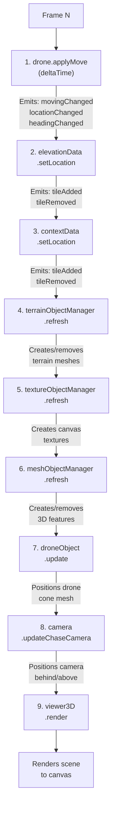
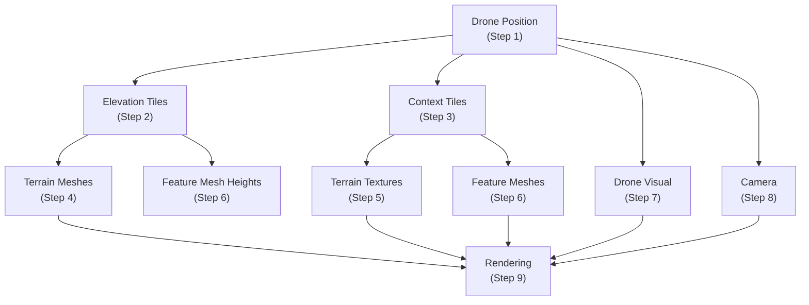

# Animation Loop Architecture

## Overview

The drone simulator uses a **frame-synchronized animation loop** orchestrated through event-driven subscriptions. The `AnimationLoop` class in `src/drone/AnimationLoop.ts` manages the requestAnimationFrame timing and delta time calculation, but the complete frame sequence involves multiple managers working together through a coordinated sequence of updates.

Each frame executes a **canonical 9-step sequence** that updates the drone's state, loads/unloads data tiles, refreshes 3D meshes, and renders the scene.

## Animation Frame Sequence

The complete animation frame order (canonical reference):



## Step-by-Step Breakdown

### Step 1: Drone Movement (`drone.applyMove(deltaTime)`)

**File:** `src/drone/Drone.ts: applyMove() method (lines 137–180)`

Updates the drone's position and heading based on keyboard input accumulated during this frame. Calculates displacement using delta time (frame-rate independent) and current movement vector.

**Emits Events:**
- `locationChanged` - triggers downstream data loading
- `headingChanged` - updates drone direction
- `movingChanged` - starts/stops animation loop when movement begins/ends

**Key Behavior:**
- Uses Mercator coordinate system internally
- Respects drone's current azimuth (heading) for forward/backward movement
- Frame-rate independent: `displacement = velocity × deltaTime`

### Step 2: Elevation Data Loading (`elevationData.setLocation()`)

**File:** `src/data/elevation/ElevationDataManager.ts`

Loads and unloads elevation tiles in a configurable ring around the drone. Responds to `drone.locationChanged` event.

**Key Behavior:**
- Maintains a **ring of tiles** around the drone (default: 2 tiles in each direction)
- Concurrency control: limits to **3 concurrent tile fetches** at a time
- Caches tiles to avoid reloading
- Evicts tiles outside the ring to save memory
- Tiles are **256×256 PNG images** from AWS Terrarium service
- Each tile contains elevation data encoded in RGB channels using Terrarium formula

**Emits Events:**
- `tileAdded(tileKey)` - when a new tile is loaded and cached
- `tileRemoved(tileKey)` - when a tile exits the ring
- `tileError` - when tile fetch fails (graceful degradation)

**Must complete before Step 4** (terrain mesh creation needs loaded elevation data).

### Step 3: Context Data Loading (`contextData.setLocation()`)

**File:** `src/data/contextual/ContextDataManager.ts`

Loads and unloads contextual data tiles (OSM features, buildings, vegetation) in a ring around the drone. Similar pattern to elevation loading.

**Key Behavior:**
- Maintains ring of tiles around drone
- Concurrency control: limits concurrent fetches
- Each tile contains GeoJSON features with spatial coordinates
- Supports caching via persistent IndexedDB cache

**Emits Events:**
- `tileAdded(tileKey)` - when context data is loaded
- `tileRemoved(tileKey)` - when tile exits ring

**Note:** This system is extensible and currently provides a template for adding new contextual data sources.

### Step 4: Terrain Mesh Refresh (`terrainObjectManager.refresh()`)

**File:** `src/visualization/terrain/TerrainObjectManager.ts`

Synchronizes Three.js mesh geometry and textures with the currently loaded elevation tiles. Runs after both elevation and context data are loaded.

**Key Behavior:**
- **Two-stage pipeline:**
  1. `TerrainGeometryObjectManager` - converts elevation tiles to Three.js geometry
  2. `TerrainTextureObjectManager` - renders context data as canvas textures
  3. Both stages are synchronized to the same tile set

- Creates meshes for newly loaded tiles
- Removes meshes for evicted tiles
- Applies textures to terrain surfaces
- Each terrain tile becomes a **~131,000 vertex mesh** (256×256 grid + normals)

**Depends on:**
- Step 2: Elevation tiles must be loaded
- Step 3: Context tiles should be available (graceful degradation if unavailable)

### Step 5: Texture Object Refresh (Implicit via Events)

**File:** `src/visualization/terrain/texture/TerrainTextureObjectManager.ts`

Triggered automatically by `tileAdded` events from both elevation and context data managers. Creates canvas-based textures for rendering.

**Key Behavior:**
- Listens to elevation `tileAdded` → creates base terrain texture
- Listens to context `tileAdded` → draws features onto terrain texture
- Caches rendered textures to avoid re-rendering same data

### Step 6: Mesh Feature Refresh (`meshObjectManager.refresh()`)

**File:** `src/visualization/mesh/MeshObjectManager.ts`

Creates and removes 3D feature meshes (buildings, trees, vegetation) based on currently available context data.

**Key Behavior:**
- Samples elevation data to position features realistically on terrain
- Creates One Three.js mesh per feature (building, tree cluster, etc.)
- Removes meshes for evicted tiles
- Uses `ElevationSampler` to get height at each feature location

**Depends on:**
- Step 2: Elevation data (for sampling height)
- Step 3: Context data (for feature locations)

### Step 7: Drone Mesh Update (`droneObject.update()`)

**File:** `src/visualization/drone/DroneObject.ts`

Updates the position and orientation of the drone's visual representation (a cone mesh) in 3D space.

**Key Behavior:**
- Positions cone at drone's current location (Mercator → Three.js conversion)
- Orients cone to match drone's azimuth (heading)
- Uses coordinate conversion: `z = -mercator.y` (see `doc/coordinate-system.md`)
- Rotation: `rotation.y = -azimuthRad` (converts clockwise azimuth to Three.js counterclockwise)

**Coordinate Transformation:**
```typescript
position.x = drone.location.x           // Mercator X → Three.js X
position.y = drone.elevation            // Elevation → Three.js Y
position.z = -drone.location.y          // Mercator Y → Three.js -Z
rotation.y = -drone.azimuthRad          // Azimuth → Three.js rotation
```

### Step 8: Camera Update (`camera.updateChaseCamera()`)

**File:** `src/3Dviewer/Camera.ts`

Positions the camera behind and above the drone, maintaining a "chase camera" view that follows the drone's movement.

**Key Behavior:**
- Places camera at a configurable distance behind drone
- Elevates camera by a configurable height above drone
- Always looks at the drone's position
- Uses same coordinate transformation as drone mesh (z = -mercator.y)
- Updates every frame for smooth following

**Chase Camera Formula:**
```typescript
behindX = drone.x - sin(azimuthRad) × chaseDistance
behindZ = drone.z + cos(azimuthRad) × chaseDistance
behindY = drone.y + chaseHeight
camera.lookAt(drone.x, drone.y, drone.z)
```

**Configuration:**
- `chaseDistance`: Distance behind drone (default: from `config.ts`)
- `chaseHeight`: Height above drone surface

### Step 9: Scene Render (`viewer3D.render()`)

**File:** `src/3Dviewer/Viewer3D.ts`

Renders the complete Three.js scene to the canvas. This is the only step that actually produces visible output.

**Key Behavior:**
- Renders all meshes (terrain, features, drone)
- Applies textures and materials
- Uses the camera positioned in Step 8
- Frame output to canvas

## Data Dependencies

The animation frame order reflects important **data dependencies**:



## Implementation Details

### Animation Loop Timing

**File:** `src/drone/AnimationLoop.ts`

The `AnimationLoop` class manages frame timing:

```typescript
private animate = (currentTime: number) => {
  this.animationFrameId = requestAnimationFrame(animate);
  const deltaTime = (currentTime - this.lastFrameTime) / 1000;  // seconds
  this.lastFrameTime = currentTime;
  this.drone.applyMove(deltaTime);
};
```

**Key Features:**
- Delta time calculated in **seconds** (not milliseconds)
- Frame-rate independent: all movement/physics use delta time
- Starts only when drone is moving (responds to `movingChanged` event)
- Stops when drone stops moving

### Event-Driven Orchestration

Steps 2-9 are triggered by **event subscriptions**, not explicit calls:

```
AnimationLoop.animate() calls:
  drone.applyMove(deltaTime)
    ↓ emits locationChanged
  ElevationDataManager listens
    → calls setLocation(newLocation)
    → emits tileAdded/tileRemoved
  ContextDataManager listens
    → calls setLocation(newLocation)
    → emits tileAdded/tileRemoved
  (Both trigger TerrainTextureObjectManager via tileAdded)
  TerrainTextureObjectManager
    → calls refresh() to create textures
  MeshObjectManager listens
    → calls refresh() to create feature meshes
  (All visual updates happen synchronously)
  (App.tsx orchestrates final render)
```

**Note:** The actual orchestration of steps 2-9 happens in `src/App.tsx` through event subscriptions. The AnimationLoop only triggers step 1 (`drone.applyMove`).

### Frame-Rate Independence

All physics and movement use **delta time** (seconds):

```typescript
displacement = velocity × deltaTime
new_x = old_x + displacement × sin(azimuthRad)
new_y = old_y + displacement × cos(azimuthRad)
```

This ensures that movement speed is independent of frame rate. A drone moving at 10 m/s will cover the same distance per second whether the game runs at 30 FPS or 60 FPS.

### Coordinate System Consistency

The entire animation loop must maintain **consistent coordinate transformations** across all components:

**World → Three.js Conversion (see `doc/coordinate-system.md`):**
- Mercator X → Three.js X (direct)
- Elevation → Three.js Y (direct)
- Mercator Y → Three.js -Z (negated)
- Azimuth (clockwise) → Three.js rotation.y (counterclockwise, negated)

All steps in the animation loop must use this same transformation to ensure spatial consistency.

## Configuration

Animation loop behavior is controlled by `src/config.ts`. See that file for `droneConfig`, `elevationConfig`, and `cameraConfig` values.

## Related Documentation

- **Coordinate System:** See `doc/coordinate-system.md` for detailed explanation of Mercator → Three.js transformation
- **Elevation Data:** See `doc/data/elevations.md` for tile loading and sampling
- **Terrain Rendering:** See `doc/visualization/ground-surface.md` for mesh generation
- **Contextual Data:** See `doc/data/contextual.md` for feature loading and feature meshes

## Key Files

| File | Purpose |
|------|---------|
| `src/drone/AnimationLoop.ts` | Frame timing loop (step 1 trigger) |
| `src/drone/Drone.ts` | Movement physics (step 1) |
| `src/data/elevation/ElevationDataManager.ts` | Elevation tile loading (step 2) |
| `src/data/contextual/ContextDataManager.ts` | Context tile loading (step 3) |
| `src/visualization/terrain/TerrainObjectManager.ts` | Terrain mesh creation (step 4) |
| `src/visualization/terrain/texture/TerrainTextureObjectManager.ts` | Terrain textures (step 5) |
| `src/visualization/mesh/MeshObjectManager.ts` | Feature mesh creation (step 6) |
| `src/visualization/drone/DroneObject.ts` | Drone mesh positioning (step 7) |
| `src/3Dviewer/Camera.ts` | Chase camera (step 8) |
| `src/3Dviewer/Viewer3D.ts` | Scene rendering (step 9) |
| `src/App.tsx` | Component orchestration & lifecycle |
